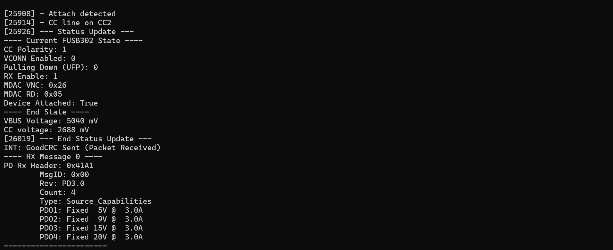
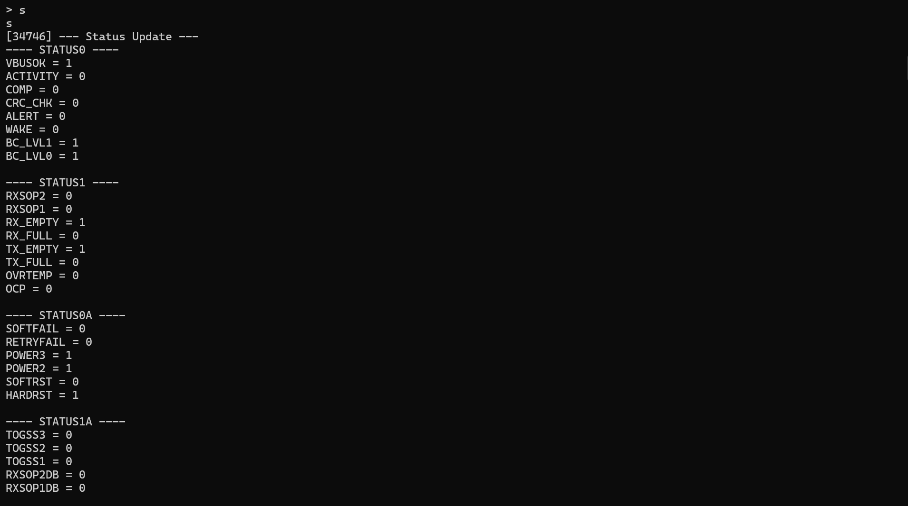
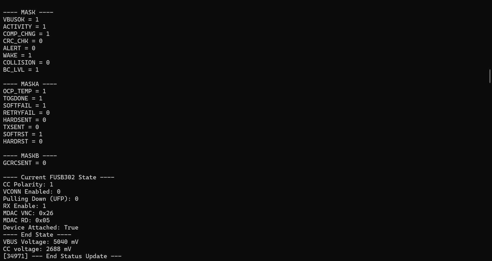
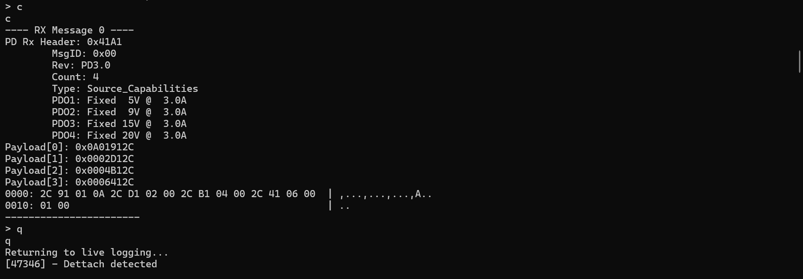

## Description
A development board to experiment with USB-C PD via an STM32 and FUSB302. 

The [PD Logger](firmware/pd_logger) firmware logs PD messages, attach/dettach events, CC voltage/orientation, and VBUS voltage. 
Connect to the board through UART and use a serial terminal to interact with 
the FUSB302 over I2C via the STM32F0. Logs will start showing once a PD capable device is detected.
A debug console menu can be accessed by pressing Enter in the terminal allowing direct writes and
reads to the FUSB302. Press "q" to exit the debug console and return to live logging. A python script 
to communicate with the PD Logger over a serial port is included in the firmware folder.

### Dev Board

### Example: Attach & Dettach Charger

Attaching USB-C PD charger:

Enter debug menu (charger still attached):

Viewing FUSB302B status registers and state machine status:

View saved PD messages and quiting debug console, followed by dettaching the charger:

### Resources
Thanks to these projects for helping me learn about USB-C PD and utilizing the FUSB302!

[USB-C-Explorer](https://github.com/ReclaimerLabs/USB-C-Explorer)

[AltmodeFriend](https://github.com/CRImier/AltmodeFriend)